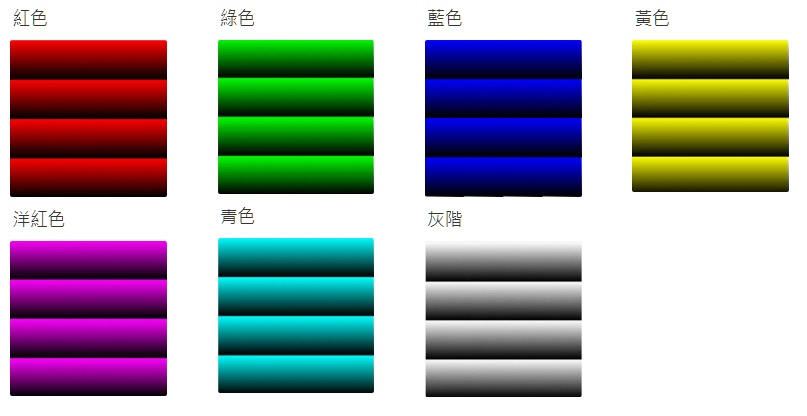
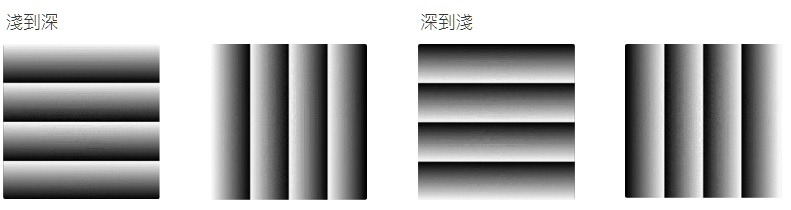

@@ -0,0 +1,99 @@
# 顏色漸層

程式介面:

使用了`tkinter`，`numpy`，`matplotlib`，`webbrowser` 四種函式庫

# 選項介紹

共有四個下拉式選單可以選擇

① 位置：共有四個位置可以選擇

②顏色：目前設置了七種顏色的選項

③方向：分別為直向跟橫向

④漸層：分別是淺到深和深到淺

# 程式介紹

程式流程圖

顯示錯誤

顏色選擇

紅色

方向選擇

橫

漸層選擇

位置選擇

# 程式結果

